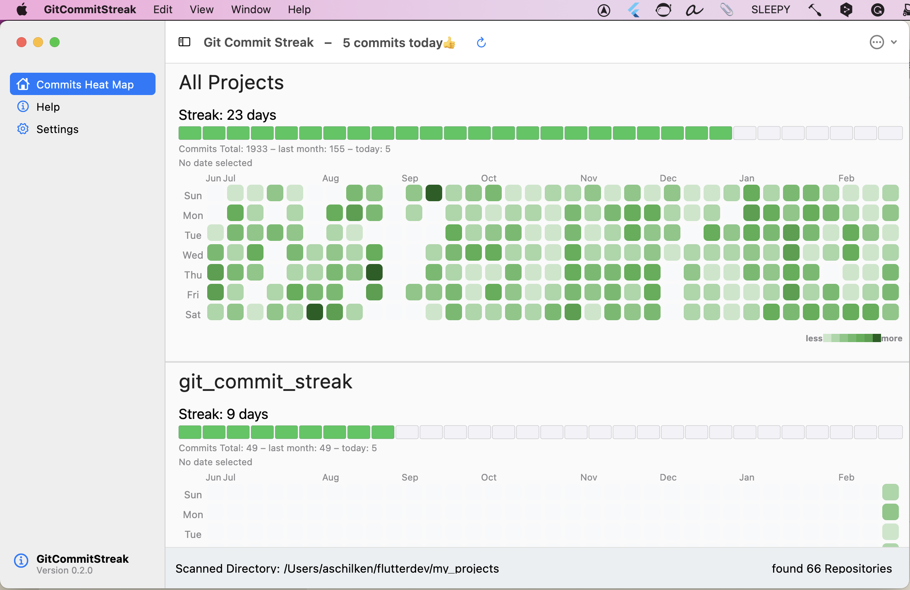
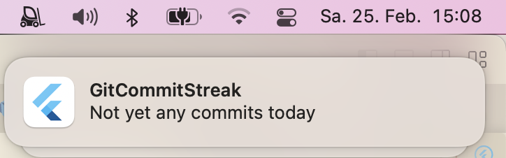
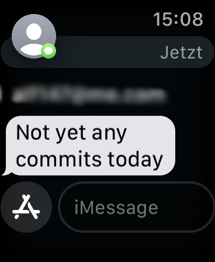

# git_commit_streak

A tool that shows how many days there are uninterrupted commits

This is a second tool made from a starter project created by mason using macosui_tool_starter.

It scans all git repositories below the selected directory and reads the git log to collect all commits done in last 240 days. From this data a "heatmap" and the commit streak is created. The heatmap is a color coded calendar. The darker the green color the more changes were committed on that day. The streak is the number of consecutive days with at least one commit per day.

## Getting Started

Create your own version if you have Flutter installed on macOS anyway.

```
git clone github.com/schilken/git_commit_streak
flutter pub get
flutter build macos
```
You find the built app here: `git_commit_streak/build/macos/Build/Products/Release/GitCommitStreak`



In the settings, you can activate reminders at a specified time, as notifications, and as iMessage.
For example, I get a notification and an iMessage at 19h if I have not yet committed anything.

On a MacBook:



On the iPhone:


On a Apple Watch:



## Download a release from GitHub
Currrently there is only a release build for [macOS] (https://github.com/schilken/git_commit_streak/releases/)


## Disable the standby mode
The cron package can only schedule the commit checks at the specified time, when the Mac is **not** powered off and the app is running in der background. 

By default, a new Mac is–at least in Europe–configured to power down after some delay being in sleep mode (`standy 1`). I use this app to remind me at 19:00, when I haven't committed anything yet. And that shall work also when the MacBook is closed. With the `pmset -c` command, I switch off the auto-power-off only when the Mac is connected to the power grid. Use `man pmset`to look up other options, for example `-a`.

``` 
$ sudo pmset -c standby 0
<enter root password>

$ pmset -g
System-wide power settings:
Currently in use:
 standby              0
...
```

## Making of this app or similar tools
I generated a starter project using mason. If you want to create a similar tool you can generate a starter project like so:
- Open https://brickhub.dev
- Search for macosui_tool_starter
- Follow the steps on the Usage page

## Credits
Several ideas are taken from https://github.com/bizz84/complete-flutter-course, a great source for learning advanced Flutter created by Andrea Bizzotto (bizz84). Also, thanks to Reuben Turner (GroovinChip) for his great package at https://github.com/GroovinChip/macos_ui
